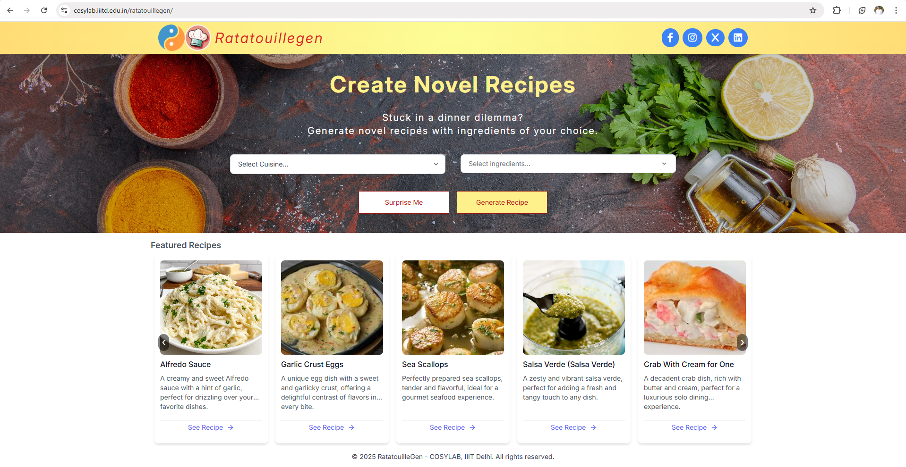

# Ratatouillegen Deployment Documentation

This document outlines the complete deployment process for the Ratatouillegen recipe generation web application developed at COSYLAB, IIIT-Delhi. It includes step-by-step instructions for deploying both the frontend (built using React) and backend (Python-based API powered by LLaMA3 models), hosted across two internal servers. The guide is structured to ensure maintainability, clarity, and reproducibility for future developers or system administrators.

**Live URL**: [https://cosylab.iiitd.edu.in/ratatouillegen/](https://cosylab.iiitd.edu.in/ratatouillegen/)

---

## Table of Contents

1. [Backend Deployment](#backend-deployment)
   - [Main Server Setup](#on-cosylabs-main-server-192168192)
   - [Secondary Server Setup](#on-secondary-server-192168331)
   - [Backend Maintenance](#backend-maintenance)
2. [Frontend Deployment](#frontend-deployment)
   - [Build Process](#1-build-the-production-version)
   - [Deployment](#2-copy-the-build-output)
   - [Nginx Configuration](#3-update-the-nginx-configuration)
   - [Frontend Maintenance](#frontend-maintenance)
3. [Troubleshooting](#troubleshooting)
4. [Application Screenshot](#application-screenshot)
5. [Copyright](#copyright)

---

## Backend Deployment

The backend handles all the recipe generation logic, API endpoints, and processing tasks for the Ratatouillegen application. It is deployed on two servers: the **main server** (`192.168.1.92`) and the **secondary server** (`192.168.3.31`).

### On Cosylab's Main Server (192.168.1.92)

#### Directory Structure

```bash
Backend/
└── llama3/
    ├── llama3_base/         # Base model directories
    ├── llama3_ft/           # Fine-tuned model versions
    ├── redirect.py          # API redirection controller
    ├── requirements.txt     # Python dependencies
    ├── total2.csv           # Region-wise ingredient information
```
```

#### Deployment Steps

1. **Activate Virtual Environment**

Activate the Conda environment named `ratatouille_new`:

```bash
conda activate ratatouille_new
```

**Why?**: This ensures all Python dependencies are isolated and consistent with the project requirements. 2. **Launch Backend with `tmux`**

Start the backend process using `tmux` to keep it running in the background:

```bash
tmux new -s ratatouille_backend
python redirect.py
```

**Why `tmux`?**: It allows the process to continue running even if you disconnect from the server. 3. **Detach from `tmux` Session**

After starting the process, detach from the session using:

```bash
Ctrl + B, then D
```

4. **Reattach to `tmux` Session**

To check or restart the backend process later, reattach to the session:

```bash
tmux attach -t ratatouille_backend
```

---

### On Secondary Server (192.168.3.31)

#### Directory Structure

```bash
testBackend/
└── llama3/
    ├── backend_llama.py       # Backend implementation
    ├── total2.csv             # Dataset file
```

#### Deployment Steps

1. **Run Backend Using `tmux`**

Start the secondary backend process using:

```bash
tmux new -s secondary_backend
python backend_llama.py
```

2. **Detach and Manage Sessions**

Use similar commands as above to detach, reattach, or terminate `tmux` sessions.

---

### Backend Maintenance

#### Managing `tmux` Sessions

- **List all sessions**:

```bash
tmux ls
```

Example output:

```bash
ratatouille_backend: 1 window (created Sat Apr 05 02:14:00 2025)
secondary_backend: 1 window (created Sat Apr 05 02:20:00 2025)
```

- **Restart a process**:
  - Attach to session:

```bash
tmux attach -t ratatouille_backend
```

    - Stop current process:

```bash
Ctrl + C
```

    - Restart:

```bash
python redirect.py
```

    - Detach:

```bash
Ctrl + B, then D
```

- **Kill a session**:

```bash
tmux kill-session -t ratatouille_backend
```

#### Log Monitoring

- Main server logs:
  - Check `nohup.out` or `output.log`.
- Secondary server logs:
  - Output appears directly in the `tmux` session.

---

## Frontend Deployment

The frontend is built using React and serves as the user interface for interacting with Ratatouille’s recipe recommendation system.

### Deployment Steps

#### 1. Build the Production Version

Navigate to the frontend directory and build an optimized production version:

```bash
cd ~/ratatouillegen/Frontend
npm install  # Only needed if dependencies changed
npm run build
```

**What this does**: Creates an optimized production build in the `build/` folder with minified JavaScript, CSS, and assets.

---

#### 2. Copy the Build Output

Transfer the compiled files to `/var/www/ratatouillegen/`:

```bash
sudo cp -r /home/cosylab/ratatouillegen/Frontend/build/. /var/www/ratatouillegen/
sudo chown -R www-data:www-data /var/www/ratatouillegen/
```

**Why `sudo`?**: The `/var/www/` directory requires root privileges for write access.

---

#### 3. Update the Nginx Configuration

Edit `/etc/nginx/sites-available/default` to include frontend and API routes:

```nginx
# Frontend Configuration
location /ratatouillegen/ {
    root /var/www;
    index index.html;
    try_files $uri $uri/ /index.html; # Enables React Router support.
}

# API Proxy Configuration
location /ratatouillegen-api/ {
    proxy_pass http://192.168.1.92:8003/;
    proxy_set_header Host $host;
    proxy_set_header X-Real-IP $remote_addr;
}
```

---

#### 4. Restart Nginx

Test and restart Nginx to apply changes:

```bash
sudo nginx -t  # Test configuration first.
sudo systemctl restart nginx
```

---

### Frontend Maintenance

#### Common Issues

- **404 Errors**:
  - Verify that `try_files` exists in the Nginx configuration.
  - Ensure build files are present in `/var/www/ratatouillegen`.
- **API Connection Failures**:
  - Confirm that the backend is running (`tmux ls`).
  - Check Nginx error logs:

```bash
sudo tail -f /var/log/nginx/error.log
```

- **Cache Issues**:
  Restart Nginx and clear browser cache:

```bash
sudo systemctl restart nginx
```

---

## Troubleshooting

### Backend Not Responding

1. Check running `tmux` sessions:

```bash
tmux ls
```

2. Verify that ports are open:

```bash
netstat -tulnp | grep 8003
```

3. Review logs for errors:

```bash
cat nohup.out
tail -f output.log
```

---

### Nginx Errors

1. Test configuration syntax:

```bash
sudo nginx -t
```

2. Resolve common issues such as permission conflicts by ensuring correct ownership of files:

```bash
sudo chown www-data:www-data var/www
```

3. For other issue move into the `Frontend` directory & follow the `README.md` provided there .

## Application Screenshot



_Figure 1: The Ratatouillegen web interface showing recipe recommendations based on selected ingredients_

By following the outlined steps, the Ratatouillegen application can be successfully deployed and maintained within the COSYLAB infrastructure. The modular structure of both frontend and backend ensures ease of updates and debugging. For any future developments or enhancements, this documentation serves as the foundational reference.

## Copyright

&copy; 2025 **COSYLAB**, IIIT-Delhi. All rights reserved.  
Developed by: **Gour Krishna Dey**, **Aditya Gupta**, and **Saurabh Mehta**  
**Ratatouillegen** was developed under the supervision of **Prof. Ganesh Bagler** & guidance of Mansi Goel.  
This deployment guide and the Ratatouillegen application are the intellectual property of **COSYLAB**, **Indraprastha Institute of Information Technology Delhi (IIIT-Delhi)**.  
Unauthorized copying, distribution, or modification of this material is strictly prohibited.
